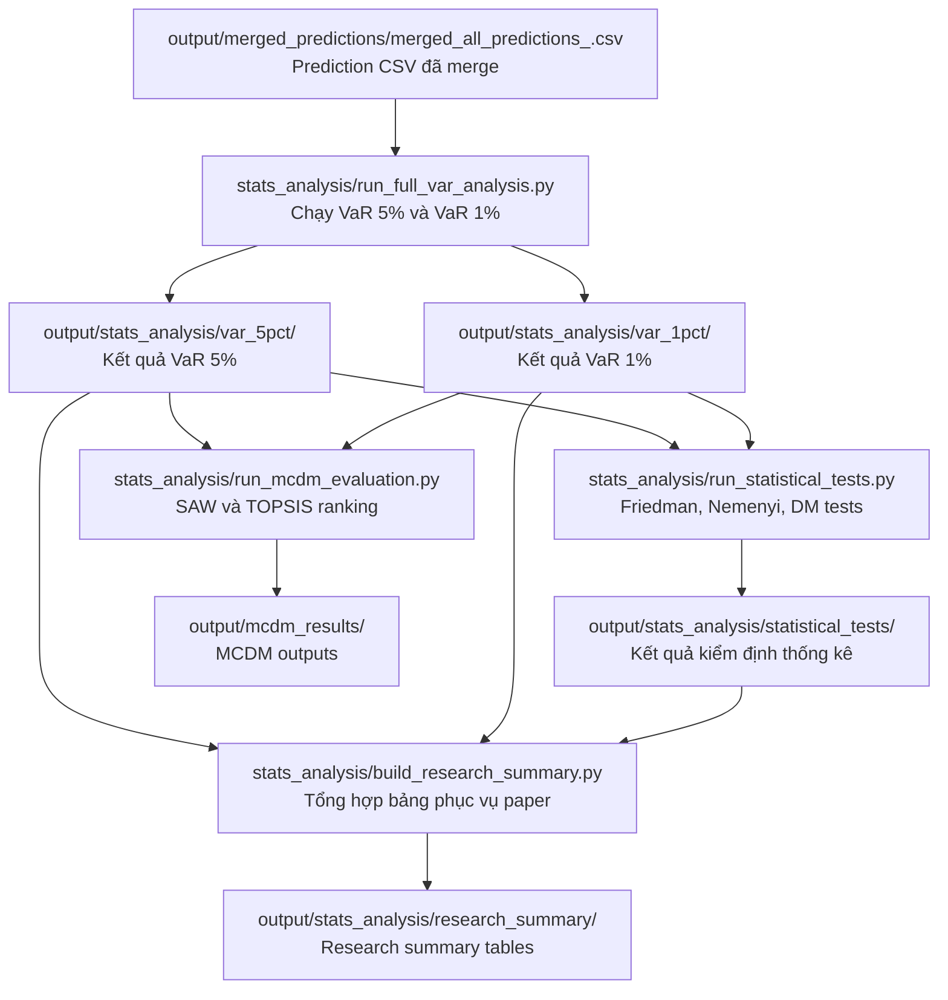

# Pipeline `stats_analysis`

Tài liệu này chú thích luồng xử lý của module `stats_analysis`, từ file prediction đã merge cho đến các bảng VaR backtesting, statistical tests, research summary và MCDM ranking.

## 1. Luồng tổng quát



Pipeline này không train lại model. Nó chỉ đọc các forecast đã có sẵn trong `output/merged_predictions/merged_all_predictions_<timestamp>.csv`, tính forecast metrics, tính VaR, backtest violation, tổng hợp ranking và tạo các bảng phục vụ paper. Trong đó `<timestamp>` là nhãn của file CSV muốn chạy.

## 2. Input chính

Input khuyến nghị của pipeline là:

```text
output/merged_predictions/merged_all_predictions_<timestamp>.csv
```

Trong đó `<timestamp>` là nhãn thời gian hoặc mã phiên bản của file CSV muốn chạy. Nếu không truyền `--input-csv`, `run_full_var_analysis.py` sẽ tự chọn file mới nhất khớp pattern `output/merged_predictions/merged_all_predictions*.csv`, rồi mới fallback về `output/merged_all_predictions.csv`.

File này cần có các cột bắt buộc:

```text
dataset
branch
tier
model
time
horizon
log_return
true_volatility
predict_volatility
```

Ý nghĩa ngắn gọn:

```text
log_return: return thực tế dùng để kiểm tra VaR violation
true_volatility: volatility mục tiêu dùng cho forecast metrics
predict_volatility: volatility do model dự báo, dùng cho cả forecast metrics và VaR
```

## 3. Vai trò từng file Python

### `stats_analysis/config.py`

File cấu hình runtime cho pipeline.

Vai trò:

```text
- Định nghĩa input legacy mặc định: output/merged_all_predictions.csv
- Định nghĩa output directory mặc định: output/stats_analysis/
- Định nghĩa alpha, pvalue_threshold, epsilon, min_history
- Định nghĩa tên các file output
```

Tên output quan trọng:

```python
detailed_filename = "stats_by_dataset_horizon.csv"
aggregate_filename = "stats_by_model.csv"
pass_cases_filename = "backtest_pass_cases.csv"
summary_filename = "stats_run_summary.csv"
var_predictions_filename = "var_predictions.csv"
```

### `stats_analysis/data_loader.py`

File đọc và validate input prediction CSV.

Vai trò:

```text
- Đọc file CSV được truyền từ `--input-csv` hoặc file mới nhất trong `output/merged_predictions/`
- Kiểm tra đủ các cột bắt buộc
- Parse cột time sang datetime
- Chuẩn hóa tier và horizon
- Đếm missing log_return, true_volatility, predict_volatility
```

Nếu input thiếu cột, pipeline sẽ dừng với `ValueError`.

### `stats_analysis/metrics.py`

File tính forecast accuracy metrics.

Vai trò:

```text
- Tính MSE
- Tính MAE
- Tính QLIKE
- Chỉ tính trên các dòng hợp lệ của true_volatility và predict_volatility
```

Đây là nhóm metric trả lời câu hỏi:

```text
Model dự báo volatility có sát true volatility không?
```

### `stats_analysis/risk.py`

File quan trọng nhất cho VaR và backtesting.

Vai trò:

```text
- Ước lượng tham số Student-t nu theo dataset
- Tính VaR threshold từ predict_volatility
- Sinh chuỗi violation
- Tính violation_rate
- Chạy Kupiec unconditional coverage test
- Chạy Christoffersen independence test
- Tạo backtest_pass
- Cung cấp các phương pháp VaR: Normal, Student-t, FHS
```

Luồng backtest chính:

```text
predict_volatility + nu
-> var_threshold
-> violations = log_return < var_threshold
-> violation_rate
-> Kupiec test
-> Christoffersen independence test
-> backtest_pass = kupiec_pass AND independence_pass
```

Ý nghĩa:

```text
Kupiec test: kiểm tra tỷ lệ violation có khớp alpha kỳ vọng không.
Christoffersen test: kiểm tra violation có bị clustering theo thời gian không.
```

### `stats_analysis/analyzer.py`

File điều phối pipeline chính.

Class chính:

```python
StatsAnalysisPipeline
```

Vai trò:

```text
- Gọi data_loader để đọc input
- Ước lượng nu theo dataset
- Tính detailed stats theo branch/tier/model/dataset/horizon
- Tạo pass_cases cho từng case backtest
- Tạo aggregate stats theo model
- Tạo var_predictions row-level
- Ghi các CSV output
```

Hàm tạo `stats_by_model.csv`:

```python
_build_aggregate_stats()
```

File `stats_by_model.csv` được tạo bằng cách group `detailed` theo:

```text
branch, tier, model
```

Sau đó aggregate:

```text
mse, mae, qlike: mean
violation_rate: mean
kupiec_lr, kupiec_p, lr_ind, lr_ind_p: mean
passed_cases: sum(backtest_pass)
pass_rate: passed_cases / valid_risk_cases
```

Đây là file cấp model, được MCDM đọc trực tiếp.

### `stats_analysis/run_full_var_analysis.py`

Entry point để tạo output chính của stats analysis.

Lệnh chạy:

```powershell
python stats_analysis\run_full_var_analysis.py
```

Vai trò:

```text
- Chạy StatsAnalysisPipeline cho VaR 5%, alpha = 0.05
- Chạy StatsAnalysisPipeline cho VaR 1%, alpha = 0.01
```

Output:

```text
output/stats_analysis/var_5pct/stats_by_dataset_horizon.csv
output/stats_analysis/var_5pct/stats_by_model.csv
output/stats_analysis/var_5pct/backtest_pass_cases.csv
output/stats_analysis/var_5pct/stats_run_summary.csv
output/stats_analysis/var_5pct/var_predictions.csv

output/stats_analysis/var_1pct/stats_by_dataset_horizon.csv
output/stats_analysis/var_1pct/stats_by_model.csv
output/stats_analysis/var_1pct/backtest_pass_cases.csv
output/stats_analysis/var_1pct/stats_run_summary.csv
output/stats_analysis/var_1pct/var_predictions.csv
```

### `stats_analysis/run_statistical_tests.py`

File chạy các kiểm định thống kê sau khi đã có output VaR.

Yêu cầu trước khi chạy:

```powershell
python stats_analysis\run_full_var_analysis.py
```

Lệnh chạy:

```powershell
python stats_analysis\run_statistical_tests.py
```

Input:

```text
output/stats_analysis/var_5pct/stats_by_dataset_horizon.csv
output/stats_analysis/var_1pct/stats_by_dataset_horizon.csv
output/stats_analysis/var_5pct/var_predictions.csv
output/stats_analysis/var_1pct/var_predictions.csv
```

Vai trò:

```text
- Chạy Friedman test cho forecast metrics: mse, mae, qlike
- Chạy Friedman/Nemenyi cho VaR metrics
- Chạy Diebold-Mariano pairwise test cho quantile loss
- Tính abs_violation_error cho từng var_method
```

Công thức:

```text
abs_violation_error = abs(violation_rate - alpha)
```

Output:

```text
output/stats_analysis/statistical_tests/friedman_results.csv
output/stats_analysis/statistical_tests/nemenyi_pairwise_results.csv
output/stats_analysis/statistical_tests/dm_var_pairwise_results.csv
```

### `stats_analysis/build_research_summary.py`

File gom các kết quả chi tiết thành bảng summary để viết paper/report.

Yêu cầu trước khi chạy:

```powershell
python stats_analysis\run_full_var_analysis.py
python stats_analysis\run_statistical_tests.py
```

Vai trò:

```text
- Tạo forecast_ranking.csv
- Tạo var_5pct_ranking.csv
- Tạo var_1pct_ranking.csv
- Tạo accuracy_risk_tradeoff.csv
- Tạo var_method_comparison.csv
- Tạo friedman_summary.csv
- Tạo nemenyi_significant_pairs.csv
- Tạo dm_significant_pairs_summary.csv
```

Output:

```text
output/stats_analysis/research_summary/
```

### `stats_analysis/run_mcdm_evaluation.py`

File chạy MCDM ranking bằng SAW và TOPSIS.

Yêu cầu trước khi chạy:

```powershell
python stats_analysis\run_full_var_analysis.py
```

Input trực tiếp:

```text
output/stats_analysis/var_1pct/stats_by_model.csv
output/stats_analysis/var_5pct/stats_by_model.csv
```

File này không đọc trực tiếp `merged_all_predictions.csv`.

Cột bắt buộc trong mỗi `stats_by_model.csv`:

```text
branch
tier
model
mse
mae
qlike
pass_rate
violation_rate
```

File tự tạo thêm:

```text
var_1pct_pass_rate
var_1pct_violation_rate
var_1pct_abs_violation_error
var_5pct_pass_rate
var_5pct_violation_rate
var_5pct_abs_violation_error
```

Script hiện chạy hai cấu hình tiêu chí:

```text
criteria_5_5:
  Accuracy 50%, risk 50%.
  Trong risk block: pass_rate 50%, abs_violation_error 50%.

criteria_3_7:
  Accuracy 30%, risk 70%.
  Trong mỗi block, các tiêu chí được chia đều trọng số.
```

Accuracy block hiện gồm cả forecast error và dynamic-tracking metrics. Hai metric dynamic được thêm để phạt các model dự báo gần như đường phẳng:

```text
volatility_std_ratio_error = abs(std(predict_volatility) / std(true_volatility) - 1)
tracking_correlation_error = 1 - max(corr(true_volatility, predict_volatility), 0)
```

Các metric này được tính theo từng `dataset + horizon`, sau đó lấy trung bình ở cấp model. Vì vậy một model dự báo constant trong từng thị trường/horizon sẽ bị phạt mạnh dù khi gộp toàn bộ dữ liệu có vẻ vẫn có variance.

Ngoài weighted score, MCDM còn có forecast sanity gate:

```text
volatility_std_ratio_error <= 0.9
tracking_correlation > 0
```

Model không qua gate sẽ được ghi vào `ExcludedModels.csv` và không được xếp hạng MCDM.

Trọng số cụ thể:

| Criterion | Direction | Weight 5,5 | Weight 3,7 |
|---|---|---:|---:|
| `mse` | cost | 0.100 | 0.060 |
| `mae` | cost | 0.100 | 0.060 |
| `qlike` | cost | 0.100 | 0.060 |
| `volatility_std_ratio_error` | cost | 0.100 | 0.060 |
| `tracking_correlation_error` | cost | 0.100 | 0.060 |
| `var_1pct_pass_rate` | benefit | 0.125 | 0.175 |
| `var_1pct_abs_violation_error` | cost | 0.125 | 0.175 |
| `var_5pct_pass_rate` | benefit | 0.125 | 0.175 |
| `var_5pct_abs_violation_error` | cost | 0.125 | 0.175 |

Output được lưu theo timestamp để không ghi đè lần chạy cũ. Riêng MCDM dùng quy ước tên deliverable dạng PascalCase, không dùng snake_case cho file ảnh, báo cáo hoặc file xuất chính của MCDM:

```text
output/mcdm_results/MCDMYYYYMMDDHHMMSS/5,5/
output/mcdm_results/MCDMYYYYMMDDHHMMSS/3,7/
```

Trong mỗi folder có các file CSV:

```text
CriteriaWeights.csv
MCDMInputMetrics.csv
ExcludedModels.csv
SAWRanking.csv
TOPSISRanking.csv
CombinedMCDMRanking.csv
GARCHAutoformerDominanceSummary.csv
GARCHAutoformerPairwiseDominance.csv
```

Các CSV ranking vẫn giữ chi tiết theo `branch/tier/model`, đồng thời có thêm:

```text
display_name: tên sạch có tier, ví dụ GARCH-Autoformer (Tier 2)
display_group: tên sạch không tier, ví dụ GARCH-Autoformer
display_model_tier: tên compact cho hình và báo cáo, ví dụ AutoformerTier3
```

Riêng các ảnh phân tích được tổng hợp theo `display_group`, tức lấy trung bình qua các tier trước khi vẽ. Cách này tránh biểu đồ bị rối bởi nhiều dòng `Tier_1`, `Tier_2`, `Tier_3`, trong khi CSV vẫn giữ đủ chi tiết để audit.

Riêng ảnh `VolatilityStdRatioErrorByModelTier.png` được vẽ theo từng model-tier, không aggregate theo family. Tên model trên trục y dùng quy ước compact PascalCase như `AutoformerTier3`, `GARCHAutoformerTier2`, hoặc `MoiraiVaRMoirai2Lambda02` để tránh snake_case và dễ đọc khi đưa vào báo cáo.

Và các ảnh phân tích:

```text
CriteriaWeights.png
SAWTopModels.png
TOPSISTopModels.png
AccuracyRiskTradeoff.png
SAWTOPSISRankComparison.png
VolatilityDynamicsPenalty.png
VolatilityStdRatioErrorByModelTier.png
```

## 4. Ý nghĩa các output của `stats_analysis`

### `stats_by_dataset_horizon.csv`

Cấp chi tiết theo:

```text
branch, tier, model, dataset, horizon
```

Dùng để xem từng model trên từng dataset và horizon có forecast/backtest ra sao.

### `backtest_pass_cases.csv`

Bảng tập trung vào VaR backtesting.

Cột quan trọng:

```text
n_risk
violation_count
violation_rate
kupiec_p
lr_ind_p
kupiec_pass
independence_pass
backtest_pass
```

Đây là file để trace vì sao một case pass hoặc fail.

### `stats_by_model.csv`

Bảng aggregate cấp model.

Đây là file quan trọng cho ranking và MCDM.

Cột quan trọng:

```text
mse
mae
qlike
violation_rate
kupiec_p
lr_ind_p
passed_cases
pass_rate
```

Công thức pass rate:

```text
pass_rate = passed_cases / valid_risk_cases
```

Trong đó:

```text
passed_cases = số case có backtest_pass = True
valid_risk_cases = số case có n_risk > 0
```

### `var_predictions.csv`

Bảng row-level, giữ VaR threshold và violation theo từng dòng thời gian.

Cột được sinh thêm:

```text
normal_var, normal_vio
student_t_var, student_t_vio
fhs_var, fhs_vio
```

Dùng để:

```text
- Vẽ chart VaR theo thời gian
- Kiểm tra từng ngày có violation hay không
- Chạy statistical tests theo từng phương pháp VaR
```

### `stats_run_summary.csv`

Bảng metadata của lần chạy.

Dùng để kiểm tra:

```text
input_csv
output_dir
input_rows
datasets
models
horizons
missing_return
missing_true_volatility
missing_predict_volatility
alpha
pvalue_threshold
```

## 5. Quan hệ giữa `violation_rate`, `abs_violation_error` và `pass_rate`

Violation được tính:

```text
violation_t = log_return_t < VaR_t
```

Violation rate:

```text
violation_rate = violation_count / n_risk
```

Absolute violation error:

```text
abs_violation_error = abs(violation_rate - alpha)
```

Pass rate:

```text
backtest_pass = kupiec_pass AND independence_pass
pass_rate = mean(backtest_pass) theo các case hợp lệ
```

Lưu ý:

```text
abs_violation_error không trực tiếp tạo ra pass_rate.
pass_rate được tạo từ Kupiec test và Christoffersen independence test.
abs_violation_error là metric bổ sung để đo độ lệch coverage so với alpha.
```

Nói cách khác:

```text
Kupiec test: đo violation_rate có lệch alpha đáng kể về thống kê không.
Christoffersen test: đo violation có độc lập theo thời gian không.
abs_violation_error: đo violation_rate lệch alpha bao nhiêu về độ lớn.
```

## 6. Thứ tự chạy để tái tạo kết quả

Thay `<timestamp>` bằng nhãn của file CSV muốn chạy, ví dụ `24_7` hoặc `20260725_170414`:

```powershell
$csv = "output\merged_predictions\merged_all_predictions_<timestamp>.csv"

python stats_analysis\run_full_var_analysis.py --input-csv $csv
python stats_analysis\run_statistical_tests.py
python stats_analysis\build_research_summary.py
python stats_analysis\check_volatility_stationarity.py --input-csv $csv
python stats_analysis\run_mcdm_evaluation.py
```

Nếu chỉ cần tạo `stats_by_model.csv` cho MCDM, chỉ cần chạy:

```powershell
python stats_analysis\run_full_var_analysis.py --input-csv "output\merged_predictions\merged_all_predictions_<timestamp>.csv"
```

Sau đó MCDM có thể đọc:

```text
output/stats_analysis/var_1pct/stats_by_model.csv
output/stats_analysis/var_5pct/stats_by_model.csv
```
