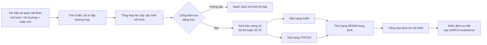
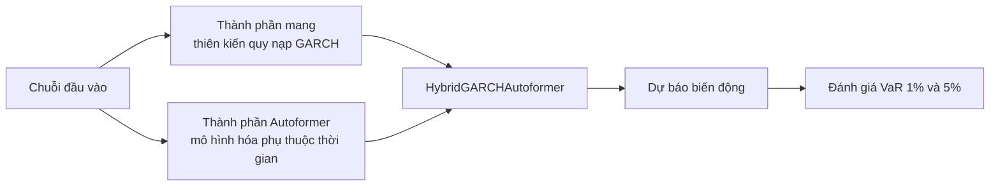
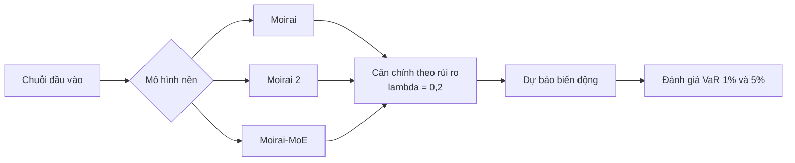

# 3. Phương pháp đề xuất

## 3.1. Tổng quan kiến trúc

Khung đề xuất nhận đầu vào là dự báo biến động, biến động thực tế và kết quả kiểm định VaR theo từng cấu hình mô hình, thị trường và chân trời. Quy trình gồm ba tầng: sàng lọc hợp lý của dự báo, xếp hạng đa tiêu chí và kiểm định ưu thế [6].



Đơn vị tính tiêu chí ban đầu là:

\[
\text{trường hợp} =
\text{branch} \times \text{tier} \times \text{model}
\times \text{dataset} \times \text{horizon}.
\]

Các tiêu chí động học phải được tính ở cấp trường hợp trước khi lấy trung bình lên cấp cấu hình. Cách làm này tránh hiện tượng gộp nhiều thị trường hoặc chân trời có mức nền khác nhau khiến một dự báo phẳng trong từng trường hợp vẫn có vẻ có phương sai khi quan sát toàn bộ dữ liệu.

## 3.2. Hai kiến trúc dự báo biến động đề xuất

### 3.2.1. GARCH-Autoformer

GARCH-Autoformer được lưu trong pipeline với định danh `HybridGARCHAutoformer` thuộc nhánh `modified_autoformer`. Ý tưởng kiến trúc được tài liệu nguồn xác nhận là lai ghép **thiên kiến quy nạp GARCH** với **Autoformer** [8]. GARCH cung cấp định hướng mô hình hóa phương sai có điều kiện và cụm biến động; Autoformer cung cấp thành phần mô hình hóa phụ thuộc chuỗi. Mục tiêu chức năng của phép lai là giữ khả năng phản ứng với động học biến động, đồng thời tạo tín hiệu phù hợp hơn cho triển khai nhạy cảm với rủi ro.



Sơ đồ trên biểu diễn các thành phần chức năng có thể xác nhận, không hàm ý một cơ chế kết hợp cụ thể. Hai cấu hình được đánh giá là:

| Cấu hình | Định danh trong kết quả | Vai trò |
|---|---|---|
| Tier 1 | `Tier_1_Miniaturized` | Biến thể thu gọn |
| Tier 2 | `Tier_2_Standard` | Biến thể tiêu chuẩn |

Các nguồn được phép sử dụng không chứa số tầng, chiều ẩn, số đầu chú ý, phương trình kết hợp đầu ra GARCH–Autoformer hoặc hàm mục tiêu huấn luyện. Vì vậy, các chi tiết này không được tự bổ sung trong bài báo.

### 3.2.2. MoiraiVaR

MoiraiVaR được lưu dưới nhánh `Moirai_VAR` và được định vị như một hướng **căn chỉnh theo rủi ro cho mô hình nền tảng chuỗi thời gian** [8]. Kiến trúc sử dụng ba mô hình nền:

1. Moirai;
2. Moirai 2;
3. Moirai-MoE.

Mỗi mô hình nền tạo thành một biến thể MoiraiVaR tương ứng. Tất cả kết quả hiện có sử dụng cấu hình \(\lambda=0{,}2\). Luồng chức năng được mô tả như sau:



Điểm mới ở mức được nguồn xác nhận là lớp căn chỉnh theo rủi ro được áp dụng nhất quán trên nhiều mô hình nền, cho phép kiểm tra liệu lợi ích có phụ thuộc kiến trúc nền hay không. Kết quả cho thấy tác động không đồng đều: biến thể dựa trên Moirai 2 hưởng lợi rõ về điểm rủi ro và MCDM, trong khi các biến thể dựa trên Moirai và Moirai-MoE không vượt mô hình nền tương ứng ở mọi tiêu chí.

Tài liệu nguồn chưa công bố \(\lambda\) nhân với thành phần hàm mất mát nào, cách sinh VaR từ đầu ra, tham số nào được tinh chỉnh, hoặc cơ chế chỉ tinh chỉnh đầu ra/tinh chỉnh toàn bộ. Do đó, bài báo chỉ ghi \(\lambda=0{,}2\) như cấu hình thực nghiệm, không tự đặt công thức hàm mục tiêu. Đây cũng là lý do phân tích loại bỏ với \(\lambda\in\{0;0{,}1;0{,}2;0{,}5\}\) và so sánh chế độ tinh chỉnh được đề xuất cho nghiên cứu tiếp theo.

### 3.2.3. Vai trò bổ sung của hai kiến trúc

Hai mô hình theo đuổi hai hướng khác nhau. GARCH-Autoformer đưa cấu trúc miền tài chính vào kiến trúc Autoformer và thể hiện lợi thế mạnh khi trọng số rủi ro cao. MoiraiVaR bắt đầu từ mô hình nền tảng có độ chính xác cao rồi căn chỉnh theo rủi ro; biến thể MoiraiVaR–Moirai 2 đạt kết quả nổi bật ở kịch bản cân bằng. Khung MCDM ở các tiểu mục tiếp theo được sử dụng để lượng hóa sự đánh đổi này.

## 3.3. Nhóm tiêu chí độ chính xác

Với \(v_t\) là biến động thực tế, \(\hat v_t\) là biến động dự báo và \(n\) là số quan sát hợp lệ, MSE được tính bởi:

\[
\operatorname{MSE}
=\frac{1}{n}\sum_{t=1}^{n}(v_t-\hat v_t)^2.
\]

MAE được xác định bởi:

\[
\operatorname{MAE}
=\frac{1}{n}\sum_{t=1}^{n}|v_t-\hat v_t|.
\]

QLIKE được pipeline sử dụng như một hàm mất mát quasi-likelihood cho dự báo biến động. Cả MSE, MAE và QLIKE đều là tiêu chí chi phí: giá trị thấp hơn biểu thị kết quả tốt hơn. Tài liệu nguồn không công bố biểu thức cài đặt cụ thể của QLIKE, vì vậy nghiên cứu không suy diễn thêm biến thể công thức ngoài kết quả đã xuất.

## 3.4. Nhóm tiêu chí bám động học

### 3.4.1. Sai số tỷ lệ độ lệch chuẩn

Tỷ lệ độ lệch chuẩn và sai số tương ứng được tính theo từng trường hợp:

\[
r_{\sigma}
=\frac{\operatorname{std}(\hat v)}
{\operatorname{std}(v)},
\qquad
e_{\sigma}=|r_{\sigma}-1|.
\]

\(e_{\sigma}\) càng nhỏ càng tốt. Nếu dự báo gần như hằng, \(\operatorname{std}(\hat v)\approx 0\), dẫn đến \(r_{\sigma}\approx 0\) và \(e_{\sigma}\approx 1\). Chỉ số này vì vậy trực tiếp phạt dự báo quá phẳng.

### 3.4.2. Sai số tương quan bám chuỗi

Tương quan bám chuỗi và sai số được xác định bởi:

\[
\rho=\operatorname{corr}(v,\hat v),
\qquad
e_{\rho}=1-\max(\rho,0).
\]

\(e_{\rho}\) là tiêu chí chi phí. Khi dự báo bám tốt hình dạng biến động thực tế, \(\rho\) tiến gần 1 và \(e_{\rho}\) tiến gần 0. Khi tương quan bằng 0 hoặc âm, dự báo không chứng minh được khả năng đồng biến tối thiểu với chuỗi thực tế.

## 3.5. Cổng kiểm tra hợp lý của dự báo

Một cấu hình chỉ được đưa vào SAW và TOPSIS khi đồng thời thỏa:

\[
e_{\sigma}\leq 0{,}9
\quad\land\quad
\rho>0.
\]

Ngưỡng \(e_{\sigma}\leq0{,}9\) là một điều kiện tương đối lỏng. Trong trường hợp độ lệch chuẩn dự báo thấp hơn độ lệch chuẩn thực tế, điều kiện này yêu cầu tỷ lệ độ lệch chuẩn đạt tối thiểu khoảng 10%. Điều kiện \(\rho>0\) bổ sung yêu cầu về đúng hướng thay đổi. Cổng kiểm tra không đồng nghĩa với chứng nhận mô hình tốt và ngưỡng 0,9 không được tuyên bố là tối ưu; đây chỉ là bước loại lỗi động học nghiêm trọng trước khi tổng hợp điểm.

## 3.6. Nhóm tiêu chí hiệu chỉnh rủi ro

Pipeline đánh giá VaR tại hai mức đuôi \(\alpha\in\{0{,}01;0{,}05\}\). Một trường hợp được xem là vượt kiểm định khi:

\[
\operatorname{pass}_{\alpha}
=\operatorname{KupiecPass}_{\alpha}
\land \operatorname{IndependencePass}_{\alpha}.
\]

Tỷ lệ vượt backtest của một cấu hình là:

\[
\operatorname{PassRate}_{\alpha}
=\frac{\text{số trường hợp vượt cả hai kiểm định}}
{\text{số trường hợp rủi ro hợp lệ}}.
\]

Đây là tiêu chí lợi ích, tức giá trị càng cao càng tốt. Sai số vi phạm tuyệt đối được tính bởi:

\[
\operatorname{ViolationRate}_{\alpha}
=\frac{\text{số vi phạm}}{n_{\text{risk}}},
\qquad
\operatorname{AVE}_{\alpha}
=|\operatorname{ViolationRate}_{\alpha}-\alpha|.
\]

\(\operatorname{AVE}_{\alpha}\) là tiêu chí chi phí. Chỉ số này đo độ gần của tỷ lệ vi phạm với mức danh nghĩa nhưng không kiểm tra tính độc lập, do đó được dùng bổ sung chứ không thay thế tỷ lệ vượt backtest.

## 3.7. Thiết kế trọng số

Chín tiêu chí được chia thành khối độ chính xác–động học gồm năm tiêu chí và khối rủi ro gồm bốn tiêu chí. Nghiên cứu sử dụng hai kịch bản:

| Tiêu chí | Chiều | Trọng số 50:50 | Trọng số 30:70 |
|---|---|---:|---:|
| MSE | Chi phí | 0,100 | 0,060 |
| MAE | Chi phí | 0,100 | 0,060 |
| QLIKE | Chi phí | 0,100 | 0,060 |
| Sai số tỷ lệ độ lệch chuẩn | Chi phí | 0,100 | 0,060 |
| Sai số tương quan bám chuỗi | Chi phí | 0,100 | 0,060 |
| Tỷ lệ vượt backtest VaR 1% | Lợi ích | 0,125 | 0,175 |
| Sai số vi phạm tuyệt đối VaR 1% | Chi phí | 0,125 | 0,175 |
| Tỷ lệ vượt backtest VaR 5% | Lợi ích | 0,125 | 0,175 |
| Sai số vi phạm tuyệt đối VaR 5% | Chi phí | 0,125 | 0,175 |

Trong kịch bản 50:50, năm tiêu chí đầu chia đều tổng trọng số 0,5 và bốn tiêu chí rủi ro chia đều tổng trọng số 0,5. Trong kịch bản 30:70, hai tổng trọng số tương ứng là 0,3 và 0,7. Tổng trọng số ở mỗi kịch bản bằng 1.

## 3.8. Xếp hạng bằng SAW

Gọi \(x_{ij}\) là giá trị tiêu chí \(j\) của cấu hình \(i\), \(r_{ij}\) là giá trị sau chuẩn hóa theo chiều lợi ích hoặc chi phí, và \(w_j\) là trọng số. Điểm SAW được tính:

\[
S_i^{\mathrm{SAW}}
=\sum_{j=1}^{9}w_j r_{ij}.
\]

Giá trị \(r_{ij}\) tăng theo mức tốt của tiêu chí: giá trị gốc càng cao càng tốt đối với tiêu chí lợi ích và càng thấp càng tốt đối với tiêu chí chi phí. Điểm SAW lớn hơn biểu thị phương án tốt hơn. Do là phép cộng tuyến tính, một tiêu chí mạnh có thể bù một phần cho tiêu chí yếu.

## 3.9. Xếp hạng bằng TOPSIS

TOPSIS chuẩn hóa vector tiêu chí, nhân trọng số và xác định nghiệm lý tưởng tốt nhất \(A^+\) cùng nghiệm lý tưởng tệ nhất \(A^-\). Với \(d_i^+\) là khoảng cách từ cấu hình \(i\) tới \(A^+\) và \(d_i^-\) là khoảng cách tới \(A^-\), hệ số gần nghiệm lý tưởng là:

\[
C_i
=\frac{d_i^-}{d_i^+ + d_i^-}.
\]

\(C_i\) càng lớn càng tốt. Khác với SAW, TOPSIS phản ánh đồng thời việc tiến gần phương án tốt nhất và rời xa phương án tệ nhất, phù hợp để nhận diện cấu hình cân bằng trên nhiều chiều.

Thứ hạng MCDM trung bình của cấu hình \(i\) được tổng hợp từ hai phương pháp:

\[
\bar R_i
=\frac{R_i^{\mathrm{SAW}}+R_i^{\mathrm{TOPSIS}}}{2}.
\]

Giá trị \(\bar R_i\) thấp hơn biểu thị kết quả tốt hơn; các cấu hình có cùng giá trị có thể đồng hạng.

## 3.10. Kiểm định ưu thế của GARCH-Autoformer

Để tránh coi các tier của cùng một họ là các đối thủ độc lập, điểm SAW và TOPSIS được lấy trung bình theo `display_group`. GARCH-Autoformer Tier 1 và Tier 2 vì vậy được gộp thành họ GARCH-Autoformer. Với mỗi trong 15 họ còn lại, một lần thắng được ghi nhận nếu:

\[
I_k=
\begin{cases}
1,& s_{\mathrm{GAF}}>s_k,\\
0,& s_{\mathrm{GAF}}\leq s_k,
\end{cases}
\]

trong đó \(s\) lần lượt là điểm SAW hoặc TOPSIS.

Kiểm định chính là kiểm định nhị thức chính xác một phía:

\[
H_0:p=0{,}5,
\qquad
H_1:p>0{,}5,
\]

với \(p\) là xác suất GARCH-Autoformer thắng một họ mô hình còn lại. Pipeline cũng báo cáo z-test một tỷ lệ:

\[
z=
\frac{\hat p-0{,}5}
{\sqrt{0{,}5(1-0{,}5)/n}}.
\]

Do \(n=15\) nhỏ, \(p\)-value của kiểm định nhị thức chính xác được ưu tiên diễn giải; z-test chỉ là xấp xỉ bổ trợ. Kiểm định này dựa trên điểm đã tổng hợp ở cấp họ mô hình, không thay thế các kiểm định Friedman, Nemenyi hoặc Wilcoxon theo từng block thị trường–chân trời.

## 3.11. Thuật toán tổng quát

```text
Đầu vào:
  - Chuỗi biến động thực tế và dự báo;
  - Kết quả backtest VaR 1% và 5%;
  - Kịch bản trọng số W.

1. Với mỗi cấu hình × thị trường × horizon:
   a. Tính MSE, MAE, QLIKE.
   b. Tính sai số tỷ lệ độ lệch chuẩn.
   c. Tính tương quan bám chuỗi và sai số tương ứng.
   d. Tính trạng thái vượt backtest và sai số vi phạm VaR.
2. Tổng hợp các tiêu chí từ cấp trường hợp lên cấp cấu hình.
3. Loại cấu hình nếu e_sigma > 0,9 hoặc rho <= 0.
4. Với mỗi kịch bản trọng số:
   a. Chuẩn hóa tiêu chí theo chiều lợi ích/chi phí.
   b. Tính điểm và thứ hạng SAW.
   c. Tính điểm và thứ hạng TOPSIS.
   d. Tính thứ hạng MCDM trung bình.
5. Lấy trung bình điểm theo họ mô hình.
6. So sánh GARCH-Autoformer với 15 họ còn lại.
7. Chạy kiểm định nhị thức chính xác một phía và z-test bổ trợ.

Đầu ra:
  - Danh sách cấu hình bị loại;
  - Bảng xếp hạng SAW, TOPSIS và kết hợp;
  - Bảng ưu thế ở cấp họ mô hình.
```
