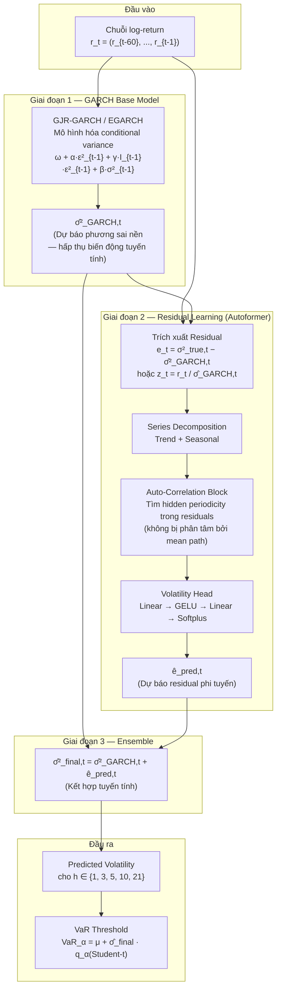
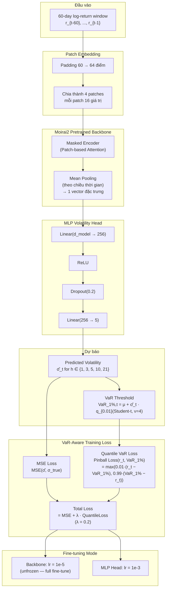
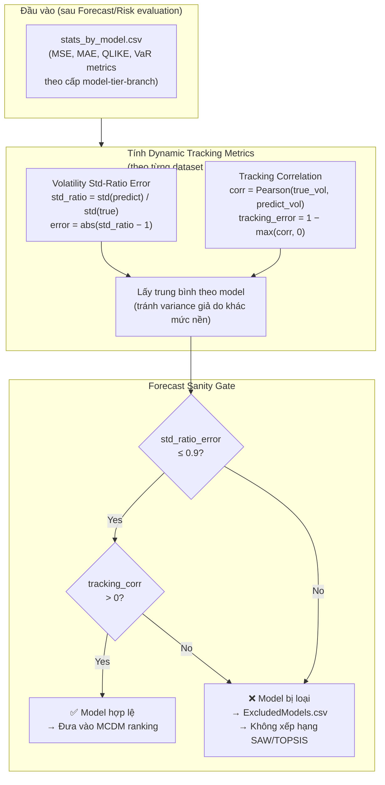
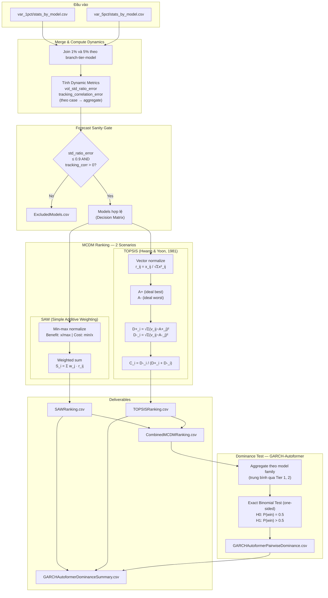

# Bố Cục Báo Cáo (26/7/2026): Các Đề Xuất Kiến Trúc + Sanity Gate + MCDM

> **Luồng tư duy:** Vấn đề & Research Gap → Cơ sở lý thuyết → **Các đề xuất của chúng tôi (với sơ đồ kiến trúc)** → Cơ sở thiết kế → Kết quả & Phân tích → Kết luận

---

## 1. ĐẶT VẤN ĐỀ VÀ RESEARCH GAP

### 1.1 Bối cảnh và Động lực nghiên cứu

Dự báo volatility là nền tảng của quản trị rủi ro tài chính (VaR, capital allocation, portfolio management). Trong thực tiễn nghiên cứu, **hai mục tiêu này vẫn bị đánh giá tách rời:**
- **Forecasting accuracy:** Tối ưu MSE, MAE, QLIKE.
- **Risk management:** Tối ưu VaR backtesting (Kupiec + Christoffersen).

Kết quả thực nghiệm (9 chỉ số, 5 horizon, 16+ mô hình) xác nhận: **Moirai-family dẫn đầu MSE/MAE/QLIKE nhưng không dẫn đầu VaR calibration** — đây là bằng chứng mạnh cho sự tách biệt của hai mục tiêu.

> **Trích dẫn:** Christoffersen & Diebold (2000); Patton (2011); Bollerslev (1986); Zhao et al., AAAI (2024); Liu et al., ICML (2025).

---

### 1.2 Research Gap — Ba lỗ hổng chưa được giải quyết

#### Gap 1 — Không có cơ chế phát hiện forecast suy biến trước khi xếp hạng

Các pipeline MCDM hiện tại đưa trực tiếp MSE/MAE/QLIKE và VaR metrics vào ranking **mà không kiểm tra liệu forecast có tracking được dynamics hay không.** Kết quả thực nghiệm: Informer Tier 3 và Reformer Tier 3 có `std(predict)/std(true) ≈ 0` và `tracking_correlation ≤ 0` — forecast phẳng hoàn toàn — nhưng vẫn có VaR violation rate tình cờ gần alpha → pass backtesting.

> **Trích dẫn:** Gneiting et al. (2007) — sharpness; Gneiting (2011) — scoring function mismatch; Kosma et al. (2022) — degenerate neural TS solutions; Patton & Sheppard (2009); DTCenter METplus.

#### Gap 2 — Thiếu framework MCDM tích hợp dynamic tracking và risk calibration

Các nghiên cứu model selection hiện tại hoặc chỉ dùng forecast accuracy, hoặc chỉ dùng VaR backtesting — **không có công trình nào kết hợp Sanity Gate với MCDM risk-sensitive selection** thành một pipeline nhất quán bao gồm cả metric động học.

> **Trích dẫn:** Hwang & Yoon (1981); Kupiec (1995); Christoffersen (1998); Patton (2011).

#### Gap 3 — Foundation Models chưa được fine-tune với VaR-aware objective cho volatility

Foundation time-series models (Moirai) được fine-tune bằng MSE thuần túy. Câu hỏi quan trọng là: **liệu việc nhúng VaR-aware loss trực tiếp vào training objective có cải thiện đồng thời forecast accuracy và tail-risk calibration không?** — câu hỏi này chưa được khám phá có hệ thống.

> **Trích dẫn:** Liu et al., ICML (2025) [Moirai-MoE]; Praetz (1972); Bollerslev (1987); Christoffersen (1998).

---

## 2. CƠ SỞ LÝ THUYẾT — TẠI SAO FORECAST PHẲNG XẢY RA?

### 2.1 Mean Reversion của chuỗi Volatility tài chính

Volatility có tính **mean-reverting**: sau shock, quay về long-run mean. Được mã hóa trong GARCH bởi `α + β < 1` (Bollerslev, 1986). Đặc tính này khiến predict hằng số gần μ cho MSE thấp mà không cần học dynamics.

> **Trích dẫn:** Bollerslev (1986); Engle (1982); Baillie et al. (1996); Mandelbrot (1963).

### 2.2 Mean Reversion ≠ Stationarity — Kiểm định thực nghiệm

**Phương pháp:** ADF + KPSS. Kết luận `stationary` chỉ khi ADF p < 0.05 VÀ KPSS p ≥ 0.05.

| Split | Stationary | Mixed | Non-stationary |
|-------|-----------|-------|----------------|
| Full | 15 (33.3%) | 30 | 0 |
| Train | 9 | 30 | 6 |
| **Val** | **0** | 22 | **23** |
| **Test** | **1** | 18 | **26** |

**Kết luận:** Test split có 26/45 chuỗi non-stationary — trong giai đoạn đánh giá, chuỗi trải qua regime shift. Mô hình học mean path trong train → khi gặp regime shift → forecast phẳng.

> **Trích dẫn:** Dickey & Fuller (1979); Kwiatkowski et al. (1992); Perron (1989); Hamilton (1994).

### 2.3 Tại sao Transformer bị flat forecast?

Transformer với 60-ngày context trên chuỗi noise cao:
- Học được mean path trong train.
- Gặp regime shift trong test → "quay về trung bình" → đường phẳng.
- **Thực nghiệm:** Informer Tier 3: `std_ratio_error = 1.000`, `tracking_corr_error = 0.985`.

> **Trích dẫn:** Chen et al., ICML (2025); Zeng et al., AAAI (2023); Lim & Zohren (2021); Kosma et al. (2022).

---

## 3. ĐỀ XUẤT CỦA CHÚNG TÔI

Bốn đóng góp chính giải quyết ba Gap:

```
┌──────────────────────────────────────────────────────────────────────┐
│  ĐỀ XUẤT 1: GARCH-Autoformer (Residual Correction Hybrid)          │
│  → Giải quyết trade-off accuracy vs risk ở cấp kiến trúc model     │
├──────────────────────────────────────────────────────────────────────┤
│  ĐỀ XUẤT 2: MoiraiVaR (VaR-Aware Foundation Model Fine-tuning)     │
│  → Giải quyết Gap 3: nhúng VaR-aware objective vào foundation model │
├──────────────────────────────────────────────────────────────────────┤
│  ĐỀ XUẤT 3: Forecast Sanity Gate                                    │
│  → Giải quyết Gap 1: phát hiện và loại forecast suy biến           │
├──────────────────────────────────────────────────────────────────────┤
│  ĐỀ XUẤT 4: MCDM Risk-Sensitive với Dynamic Tracking Metrics       │
│  → Giải quyết Gap 2: xếp hạng đa tiêu chí toàn diện               │
└──────────────────────────────────────────────────────────────────────┘
```

---

### 3.1 Đề xuất 1 — GARCH-Autoformer: Kiến trúc Lai Residual Correction

#### 3.1.1 Động lực

| | GARCH truyền thống | Autoformer thuần túy |
|--|----|----|
| **Thế mạnh** | Bám mean-reverting baseline, MSE/QLIKE ổn định | Bắt shock và chu kỳ, VaR pass rate cao hơn |
| **Điểm yếu** | Phản ứng chậm với extreme shock → Kupiec fail | Over-smoothing → gọt micro-oscillation → MSE/QLIKE cao |

**Giải pháp:** GARCH xử lý phần tuyến tính (mean-reverting baseline), Autoformer xử lý phần phi tuyến (residual dynamics).

#### 3.1.2 Sơ đồ kiến trúc



#### 3.1.3 Lợi ích kỳ vọng

- **MSE/QLIKE ổn định:** GARCH đã bám đường nền → không bao giờ over-smooth.
- **VaR cải thiện:** Khi có extreme shock, Autoformer nhận diện residual spike → bơm thêm vào forecast → VaR phình to kịp thời → Kupiec test pass.

> **Trích dẫn:** Bollerslev (1986); Wu et al., NeurIPS (2021); Donaldson & Kamstra (1997); Khashei & Bijari (2010); Kim & Won (2018); Zhao et al., AAAI (2024); Sezer et al. (2020).

---

### 3.2 Đề xuất 2 — MoiraiVaR: VaR-Aware Fine-tuning của Foundation Model

#### 3.2.1 Động lực

Moirai-family vốn mạnh nhất về MSE/MAE/QLIKE nhưng VaR calibration chưa tốt vì được fine-tune bằng MSE thuần túy. **Ý tưởng:** Nhúng trực tiếp VaR-aware objective vào training để model đồng thời tối ưu forecast accuracy VÀ tail-risk calibration.

#### 3.2.2 Sơ đồ kiến trúc



#### 3.2.3 Hai chế độ fine-tuning

| Chế độ | Backbone | Head | λ | Mục đích |
|--------|----------|------|---|----------|
| **Head-only** | Frozen | Trainable | 0.0 | Baseline MSE |
| **Head-only VaR-aware** | Frozen | Trainable | 0.2 | Nhúng VaR signal, bảo toàn backbone |
| **Full fine-tune VaR-aware** | Unfrozen (lr=1e-5) | Trainable (lr=1e-3) | 0.2 | Thích nghi backbone với financial data |

#### 3.2.4 Kết quả chính (Full fine-tune, λ=0.2, so với Moirai2 baseline)

| Metric | Baseline | Full fine-tune | Thay đổi |
|--------|----------|---------------|----------|
| MSE | 0.02286 | 0.02157 | **−5.66%** |
| MAE | 0.09071 | 0.08783 | **−3.17%** ✓ (p=0.033) |
| QLIKE | 0.00908 | 0.00863 | **−4.92%** |
| **MSE/MAE/QLIKE Rank** | — | **#1** toàn bộ models | |

**Claim:** VaR-aware fine-tuning cải thiện đáng kể realized volatility forecasting, nhưng lợi thế này chưa chuyển hóa hoàn toàn thành VaR calibration superiority — minh chứng cho việc point forecast accuracy và tail-risk calibration là hai mục tiêu liên quan nhưng không đồng nhất.

> **Trích dẫn:** Liu et al., ICML (2025); Praetz (1972); Blattberg & Gonedes (1974); Bollerslev (1987); Christoffersen (1998); Fan et al. (2008) [Student-t VaR for fat tails].

---

### 3.3 Đề xuất 3 — Forecast Sanity Gate

#### 3.3.1 Hai điều kiện tối thiểu

| Điều kiện | Công thức | Ngưỡng | Mục đích |
|-----------|-----------|--------|----------|
| Std-ratio | `abs(std(predict)/std(true) − 1) ≤ 0.9` | ≤ 0.9 | Loại flat forecast |
| Tracking corr | `corr(predict, true) > 0` | > 0 | Loại wrong-direction forecast |

**Metric tính theo từng `dataset × horizon`** trước khi aggregate để tránh variance giả.

#### 3.3.2 Sơ đồ pipeline Gate



#### 3.3.3 Kết quả Gate (5 models bị loại)

| Model | Std-ratio error | Tracking corr | Lý do |
|-------|----------------|---------------|-------|
| Reformer (Tier 3) | 1.000 | −0.00247 | Phẳng + âm |
| Informer (Tier 1) | 0.649 | −0.00406 | Tracking âm |
| Autoformer (Tier 3) | 0.919 | +0.00677 | Std-ratio > 0.9 |
| Vanilla (Tier 3) | 1.000 | −0.000124 | Phẳng + âm |
| Informer (Tier 3) | 1.000 | −0.00174 | Phẳng + âm |

> **Trích dẫn:** Gneiting et al. (2007); Gneiting (2011); DTCenter METplus; Patton & Sheppard (2009); Kosma et al. (2022).

---

### 3.4 Đề xuất 4 — MCDM Risk-Sensitive với Dynamic Tracking Metrics

#### 3.4.1 Bộ 9 tiêu chí tích hợp

| Nhóm | Metric | Direction | Trọng số 5,5 | Trọng số 3,7 |
|------|--------|-----------|-------------|-------------|
| Forecast accuracy | MSE | cost | 0.100 | 0.060 |
| Forecast accuracy | MAE | cost | 0.100 | 0.060 |
| Forecast accuracy | QLIKE | cost | 0.100 | 0.060 |
| **Dynamic tracking** | **Std-Ratio Error** | **cost** | **0.100** | **0.060** |
| **Dynamic tracking** | **Tracking Corr Error** | **cost** | **0.100** | **0.060** |
| Risk calibration | VaR 1% Pass Rate | benefit | 0.125 | 0.175 |
| Risk calibration | VaR 1% Abs Violation | cost | 0.125 | 0.175 |
| Risk calibration | VaR 5% Pass Rate | benefit | 0.125 | 0.175 |
| Risk calibration | VaR 5% Abs Violation | cost | 0.125 | 0.175 |

#### 3.4.2 Sơ đồ pipeline MCDM đầy đủ



#### 3.4.3 Dominance Test — Kiểm định thống kê

- **H0:** P(GARCH-Autoformer thắng một model family) = 0.5
- **H1:** P > 0.5
- **Kiểm định chính:** Exact binomial test one-sided (n nhỏ → exact test ưu tiên hơn z-test).

> **Trích dẫn:** Hwang & Yoon (1981); Kupiec (1995); Christoffersen (1998); Demšar (2006).

---

## 4. GIẢI THÍCH CƠ SỞ THIẾT KẾ

### 4.1 Tại sao GARCH-Autoformer (Residual Correction) thay vì end-to-end?
Transformer thuần túy học chuỗi gốc nhiễu → rơi vào nghiệm phẳng. GARCH-Autoformer phân tách: phần tuyến tính (GARCH) + phần phi tuyến (Autoformer) → mỗi module xử lý tín hiệu sạch hơn. Triết lý "Divide and Conquer" — nền tảng từ Donaldson & Kamstra (1997), Kim & Won (2018).

### 4.2 Tại sao MoiraiVaR dùng λ = 0.2 và Student-t (ν=4)?
- **λ = 0.2:** Cân bằng giữa forecast accuracy (λ=0 = MSE-only) và tail-risk focus (λ lớn → overfit VaR, quên volatility path). Giá trị 0.2 là trade-off thực nghiệm.
- **Student-t (ν=4):** Returns tài chính có fat tails → Gaussian assumption thiếu mass ở tail → underestimate risk. Student-t với ν ≈ 4–6 là lựa chọn có tiền lệ trong kinh tế lượng tài chính (Bollerslev, 1987; Praetz, 1972).

### 4.3 Tại sao Sanity Gate cần thiết dù đã có MSE?
MSE không phân biệt: MSE = 0.20 vì forecast phẳng khác với MSE = 0.20 vì tracking tốt nhưng có noise. VaR pass rate có thể tình cờ tốt khi violation rate ngẫu nhiên gần alpha. Gate là *bước sàng lọc tối thiểu* — không thay thế MCDM.

### 4.4 Tại sao SAW + TOPSIS song song?
- **SAW:** Bù trừ tuyến tính → đánh giá "tổng giá trị mang lại".
- **TOPSIS:** Phạt mạnh khi lệch xa ideal ở bất kỳ chiều → tìm "mô hình không có điểm yếu nghiêm trọng".
- Đồng thuận giữa hai phương pháp = bằng chứng vững chắc hơn.

---

## 5. KẾT QUẢ VÀ PHÂN TÍCH

### 5.1 Kết quả Forecast Ranking (Top models theo MSE)

| Rank | Model | MSE | MAE | QLIKE |
|------|-------|-----|-----|-------|
| **1** | **MoiraiVaR Full FT - Moirai2 (λ=0.2)** | **0.0216** | **0.0878** | **0.0086** |
| 2 | Moirai 2 (baseline) | 0.0228 | 0.0906 | 0.0091 |
| 3 | MoiraiVaR - Moirai2 (head-only, λ=0.2) | 0.0238 | 0.0948 | 0.0091 |
| 4 | Moirai-MoE | 0.0248 | 0.0976 | 0.0091 |
| ... | GARCH-LSTM-Hybrid | 0.1105 | 0.2362 | 0.0340 |
| ... | Transformer / Informer / Autoformer | 0.19–0.93 | 0.32–0.51 | 0.07–0.16 |

### 5.2 Kết quả Sanity Gate (5 models bị loại)

Xem bảng tại Phần 3.3.3 — tất cả đều là Transformer tier lớn.

### 5.3 MCDM — Cấu hình 5,5 (Accuracy 50% / Risk 50%)

| Rank | Model | Accuracy score | Risk score | SAW rank | TOPSIS rank |
|------|-------|---------------|-----------|---------|------------|
| 1 | MoiraiVaR - Moirai 2 (λ=0.2) | **0.496** | 0.180 | 1 | 3 |
| 1 | **GARCH-Autoformer (Tier 2)** | 0.223 | **0.443** | 3 | **1** |
| 3 | Moirai-MoE | 0.492 | 0.179 | 2 | 4 |

- GARCH-Autoformer (Tier 2) đạt **TOPSIS rank 1** — gần điểm lý tưởng đa chiều nhất.
- MoiraiVaR dẫn SAW nhờ accuracy score cao.
- **Dominance test (TOPSIS):** GARCH-Autoformer thắng **15/15**, p = 0.000031.

### 5.4 MCDM — Cấu hình 3,7 (Accuracy 30% / Risk 70%)

| Rank | Model | SAW rank | TOPSIS rank | SAW score | TOPSIS score |
|------|-------|---------|------------|----------|-------------|
| **1** | **GARCH-Autoformer (Tier 2)** | **1** | **1** | 0.754 | 0.740 |
| 2 | Reformer (Tier 2) | 3 | 2 | 0.589 | 0.695 |
| 3 | GARCH-Autoformer (Tier 1) | 2 | 5 | 0.672 | 0.673 |

- **Dominance test (SAW + TOPSIS):** Thắng **15/15**, p = 0.000031 cả hai.
- Mean relative difference: +96.7% (SAW), +102.18% (TOPSIS).

### 5.5 Phân tích Trade-off — Bức tranh tổng hợp

| Model | Forecast accuracy | VaR calibration | Phù hợp deployment |
|-------|-----------------|-----------------|-------------------|
| **MoiraiVaR Full FT** | **Tốt nhất (rank #1)** | Trung bình | Point forecast |
| **MoiraiVaR Head-only** | Tốt (rank #3) | Trung bình | Point forecast |
| **Moirai-family** | Rất tốt | Trung bình | Point forecast |
| **GARCH-Autoformer** | Trung bình | **Tốt nhất (risk-sensitive)** | Risk management |
| Transformer thuần túy | Yếu → bị Gate loại | — | Không hợp lệ |

**Insight chính:** Không có một ranking duy nhất — phụ thuộc vào deployment objective. MoiraiVaR chứng minh VaR-aware fine-tuning cải thiện forecast accuracy nhưng chưa giải quyết hoàn toàn tail-risk calibration.

> **Trích dẫn:** Christoffersen & Diebold (2000); Patton (2011); Fikri (2025).

---

## 6. KẾT LUẬN VÀ HƯỚNG MỞ RỘNG

### 6.1 Bốn đóng góp chính

1. **GARCH-Autoformer:** Kiến trúc lai 3 giai đoạn (GARCH baseline + Autoformer residual learning + linear ensemble). TOPSIS rank 1 ở cả hai kịch bản, thắng 15/15 model family ở risk-sensitive (p = 0.000031).

2. **MoiraiVaR (VaR-Aware Fine-tuning):** Full fine-tuning Moirai2 với loss = MSE + λ·QuantileLoss(VaR_1%) đạt MSE/MAE/QLIKE rank #1 trong toàn bộ models. Cung cấp bằng chứng rằng point forecast accuracy và tail-risk calibration là hai mục tiêu liên quan nhưng không đồng nhất.

3. **Forecast Sanity Gate:** Cơ chế sàng lọc tối thiểu (std_ratio_error ≤ 0.9 + tracking_corr > 0) loại 5/26 Transformer tier lớn có forecast suy biến trước khi đưa vào MCDM ranking.

4. **MCDM Risk-Sensitive với Dynamic Tracking:** Framework 9 tiêu chí, 2 phương pháp xếp hạng (SAW + TOPSIS), 2 kịch bản preference (5,5 và 3,7), kết thúc bằng exact binomial dominance test.

### 6.2 Hạn chế và Hướng mở rộng

| Hạn chế hiện tại | Hướng mở rộng |
|-----------------|--------------|
| Dominance test ở cấp aggregate | Block-level SAW/TOPSIS + Friedman/Nemenyi trên 45 blocks |
| Ngưỡng Gate (0.9, corr > 0) chưa có ablation | Ablation: 0.8, 0.85, 0.9, 0.95 |
| λ = 0.2 chưa có ablation đầy đủ | Chạy λ ∈ {0.0, 0.1, 0.2, 0.5} |
| MoiraiVaR chưa có direct VaR head | Thêm VaR 1% + VaR 5% head riêng biệt |
| Chưa có Expected Shortfall | Mở rộng sang ES, CVaR, Basel III backtests |
| Stationarity suy ra từ split 70/15/15 | Rolling stationarity + regime-aware evaluation |

---

## PHỤ LỤC: Bản đồ Trích dẫn theo Section

| Section | Trích dẫn chính |
|---------|----------------|
| **1.1** | Christoffersen & Diebold (2000); Patton (2011); Bollerslev (1986) |
| **1.2 Gap 1** | Gneiting 2011; Gneiting et al. 2007; Kosma 2022; DTCenter; Patton & Sheppard 2009 |
| **1.2 Gap 2** | Hwang & Yoon 1981; Kupiec 1995; Christoffersen 1998 |
| **1.2 Gap 3** | Liu et al. ICML 2025; Praetz 1972; Bollerslev 1987 |
| **2.1** | Bollerslev 1986; Engle 1982; Baillie et al. 1996; Mandelbrot 1963 |
| **2.2** | Dickey & Fuller 1979; Kwiatkowski et al. 1992; Perron 1989 |
| **2.3** | Chen et al. ICML 2025; Zeng et al. AAAI 2023; Lim & Zohren 2021; Kosma 2022 |
| **3.1 — GARCH-Autoformer** | Bollerslev 1986; Wu et al. NeurIPS 2021; Donaldson & Kamstra 1997; Kim & Won 2018; Zhao et al. AAAI 2024; Sezer et al. 2020 |
| **3.2 — MoiraiVaR** | Liu et al. ICML 2025; Praetz 1972; Blattberg & Gonedes 1974; Bollerslev 1987; Christoffersen 1998; Fan et al. 2008 |
| **3.3 — Sanity Gate** | Gneiting et al. 2007; Gneiting 2011; DTCenter; Patton & Sheppard 2009; Kosma 2022 |
| **3.4 — MCDM** | Hwang & Yoon 1981; Zeleny 1982; Kupiec 1995; Christoffersen 1998; Demšar 2006 |
| **5.5 — Trade-off** | Christoffersen & Diebold 2000; Patton 2011; Fikri 2025 |

---

## GHI CHÚ THỰC HIỆN

> [!IMPORTANT]
> **Phần 3 bây giờ có 4 đề xuất.** GARCH-Autoformer và MoiraiVaR đều là đóng góp kiến trúc/training-method. Sanity Gate và MCDM là đóng góp về evaluation framework.

> [!TIP]
> Thứ tự khuyến nghị khi viết: Model contributions (3.1, 3.2) → Evaluation framework (3.3, 3.4). Trình bày theo thứ tự từ model-level đến pipeline-level.

> [!NOTE]
> **Nguồn số liệu:**
> - MoiraiVaR: `docs/research_summary/2026-07-19/bao_cao_moirai2_var_aware_full_finetune.md`
> - GARCH-Autoformer: `docs/research_summary/2026-07-21/method2_hybrid_garch_autoformer.md`
> - MCDM results: `output/mcdm_results/MCDM20260725170414/`
> - Sanity Gate results: `output/mcdm_results/MCDM20260727104251/5,5/ExcludedModels.csv`
> - Forecast ranking: `output/stats_analysis/research_summary/forecast_ranking.csv`

> [!WARNING]
> **Lưu ý về MoiraiVaR:** Claim phải đúng mức — không claim "VaR forecasting vượt trội toàn diện" mà claim "VaR-aware fine-tuning cải thiện đáng kể forecast accuracy; cải thiện này chưa chuyển hóa hoàn toàn sang VaR calibration — bằng chứng cho sự tách biệt của hai mục tiêu".
